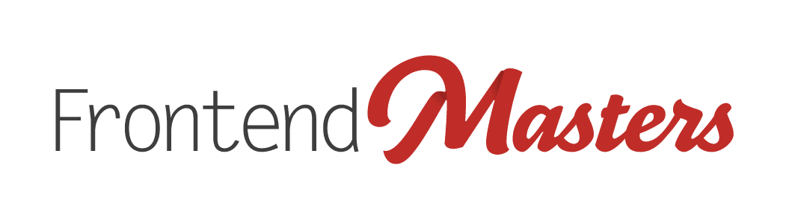

# FEM-python3
🐍🐍🐍🐍🐍🐍🐍🐍🐍🐍🐍🐍🐍🐍🐍🐍🐍🐍🐍🐍🐍🐍🐍🐍🐍🐍🐍🐍🐍🐍🐍🐍🐍🐍🐍🐍🐍🐍🐍🐍🐍

🐍🐍🐍🐍🐍🐍🐍🐍🐍🐍🐍🐍🐍🐍🐍🐍🐍🐍🐍🐍🐍🐍🐍🐍🐍🐍🐍🐍🐍🐍🐍🐍🐍🐍🐍🐍🐍🐍🐍🐍🐍
Project created from Frontend Masters workshop: 
"A Practical Guide to Python - An immersive hands-on Python Course" 
-by *Nina Zakharenko*

Slides Website: https://practical.learnpython.dev/

### 🥚 Easter egg (Python Philosophy)
- Enter REPL (>>>) in terminal with "python"
- type "import this"

*The Zen of Python, by Tim Peters*

*Beautiful is better than ugly.*
*Explicit is better than implicit.*
*Simple is better than complex.*
*Complex is better than complicated.*
*Flat is better than nested.*
*Sparse is better than dense.*
*Readability counts.*
*Special cases aren't special enough to break the rules.*
*Although practicality beats purity.*
*Errors should never pass silently.*
*Unless explicitly silenced.*
*In the face of ambiguity, refuse the temptation to guess.*
*There should be one-- and preferably only one --obvious way to do it.*
*Although that way may not be obvious at first unless you're Dutch.*
*Now is better than never.*
*Although never is often better than *right* now.*
*If the implementation is hard to explain, it's a bad idea.*
*If the implementation is easy to explain, it may be a good idea.*
*Namespaces are one honking great idea -- let's do more of those!*

### 🐍 Style Convention: snake_case
- lower case words
- use underscore for spacing

*Everything is a object in Python*
*True + True => 2*
*True = 1*
*False = 0*

### Keywords:
- None 
- True
- False
- list
- str
- \backslash to ignore ("escape character")
- \n new line
- \t new tab

### Helpful REPL (>>>) methods:
- type() - checks type of a variable
- dir() - show me all the methods for this type
  - eg. dir(str)
    - ignore double underscore ones
    - lists all methods for str
- help()
  - eg. help(str.isalpha)
    - help on method (str.isalpha) / class (like str)
    - space to scroll down
    - q to exit

### Numbers/Math in Python
- integers
  - type(5) 
  - int(5.2) => 5
- floats 
  - type(5.2) 
  - float(3) => 3.0
- complex
   - type(25p)

- power
  - 2 ** 3 => 2x2x2 => 8
- min
  - min(1, 5, -3) => -3
- max
- round
  - round(3.1) => 3
  - round(3.9) => 4

+= increment
-= decrement

### Print()
- print("hi)
  - hi
- print("hi", 5)
  - hi 5
- concatenation
  - "hi" + "bye"
    - "hibye"

### F Strings (format strings)
- name = "Johann"
- f"Hi, my name is {name}."
=> "Hi, my name is Johann."
- string.replace("this", "that")
- **However, strings are immutable.** 
- Thus, to save the change you must save the result to a new variable. 

### Lists
- **Lists are mutable - can be changed.** 
- [ ] - declared with square brakcets
- names = ["Johann", "Sam", "Suzie",]
  - trailing commas are encourages
- methods:
  - len(list)
  - list[index]
  - sorted(list)
    - **this does NOT change original list**
    - optionally, reverse list
      - sorted(list, reverse=True)
  - list.sort()
      - **this DOES change original list**
  - list.append(12345)
    - adds to end of list
  - list.insert(position_to_insert, 55)
    - list.insert(0, 55)
    - inserts 55 at position 0 (beginning of list)
  - item **in** list
    - returns True or False
  - To find out more about list methods
    - dir(list) - finds all methods
    - help(list.count) - info about a specific method